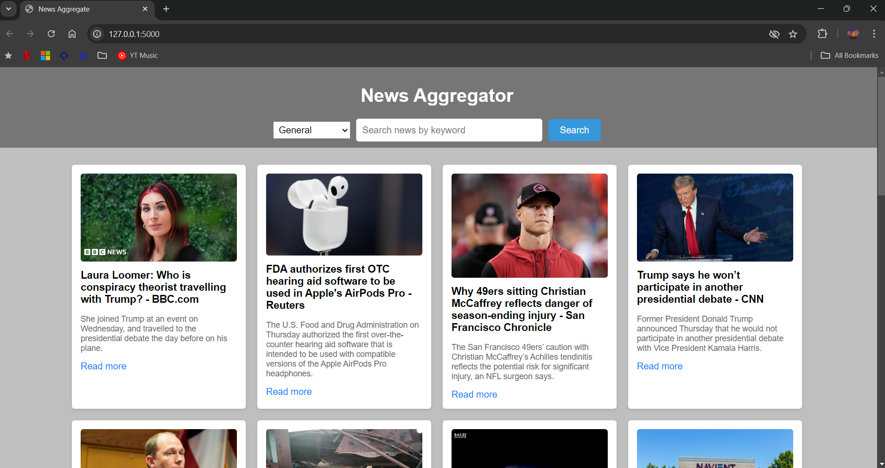

This is a news aggregation application that fetches real-time news articles from various categories using an external API. The app also allows users to search for news based on specific keywords and dynamically updates the content. It includes a responsive front-end and a back-end API to handle news data requests.

## Features
- Fetches news articles from various categories (technology, business, sports, etc.)
- Keyword search functionality to filter news
- Loading spinner while fetching news
- Responsive design with a user-friendly interface
- Search triggered by pressing Enter or clicking the search button

## Skills and Technologies Used

### 1. **Front-End Development**
- **HTML5**: The structure of the web application is created using semantic HTML tags.
- **CSS3**: Used for styling the layout, buttons, and input fields, making the app responsive and visually appealing.
    - **Flexbox**: Employed for aligning elements and creating a flexible layout.
    - **CSS Animations**: Spinner created using simple CSS animations.
- **JavaScript (ES6+)**: 
    - Fetching news articles from the back-end API asynchronously using `fetch()`.
    - Dynamic DOM manipulation for displaying fetched news.
    - Event listeners for category selection, button clicks, and Enter key press.
    - Input validation and error handling.

### 2. **Back-End Development**
- **Python (Flask)**: A simple Flask back-end is used to handle API requests and forward them to the external news API.
    - **Routing**: Flask is used to route different requests based on category or search query.
    - **JSON**: Data is fetched and returned in JSON format from the external API and passed to the front-end.
    - **Environment Configuration**: The back-end uses environment variables for sensitive data such as the API key.

### 3. **API Integration**
- **NewsAPI**: The external [NewsAPI](https://newsapi.org/) is integrated for fetching real-time news articles based on the category and search queries.
    - Parameters such as `category` and `q` (for keyword search) are used to filter the news.